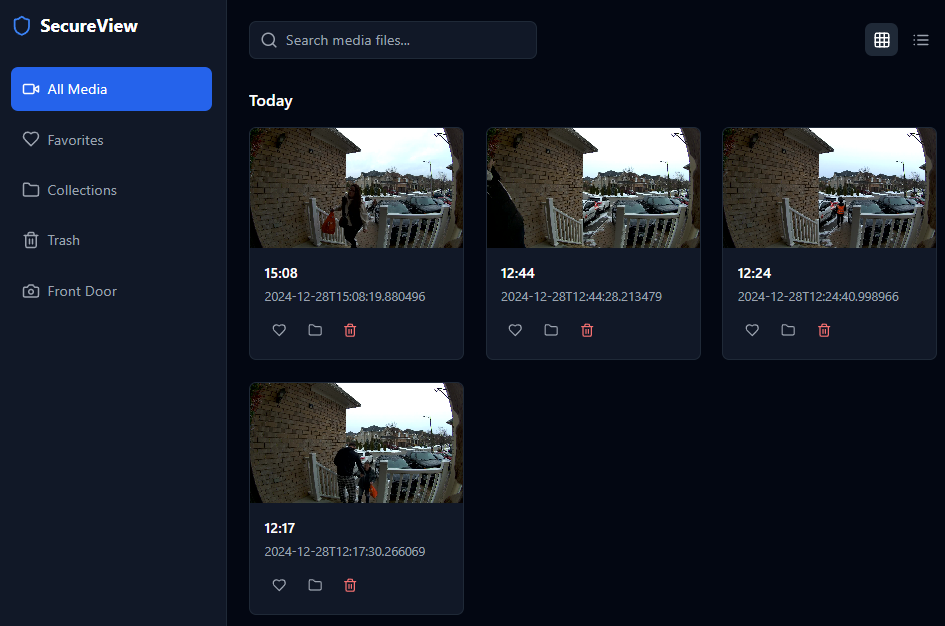

# Home Security Video Viewer

Home Security Video Viewer is a web application designed to view video files fetched by motion detectors. It does not provide live streams but allows users to browse, search, and manage recorded video files.



## Features

-   View recorded video files
-   Search for specific video files
-   Mark videos as favorites
-   Delete unwanted videos
-   Organized by date with "Today" and "Yesterday" labels
-   Grid and list view modes
-   Sidebar navigation for different sections

## Installation

1. **Clone the repository:**

    ```sh
    git clone https://github.com/your-username/home-security-video-viewer.git
    cd home-security-video-viewer
    ```

2. **Install dependencies:**

    ```sh
    npm install
    ```

3. **Start the development server:**

    ```sh
    npm run dev
    ```

4. **Open your browser and navigate to:**

    http://localhost:5173

## Usage

### Viewing Videos

-   **All Media:** View all recorded videos.
-   **Favorites:** View videos marked as favorites.
-   **Collections:** (Future feature) Organize videos into collections.
-   **Trash:** View and manage deleted videos.
-   **Front Door:** View videos recorded by the front door camera.

### Searching Videos

-   Use the search bar at the top to search for specific video files by filename.

### Managing Videos

-   **Mark as Favorite:** Click the heart icon on a video to mark it as a favorite.
-   **Delete Video:** Click the trash icon on a video to delete it.
-   **Play Video:** Click on a video thumbnail to play it.

## Project Structure

-   **`src/components`:** Contains React components used in the application.
-   **`src/hooks`:** Contains custom hooks, including `useMediaFiles` for fetching and managing video files.
-   **`src/types`:** Contains TypeScript type definitions.
-   **`public/feed`:** Directory where video files and thumbnails are stored.

## API Endpoints

-   **`GET /feed/feed-list.json`:** Fetch the list of video files.
-   **`DELETE /api/deleteFile`:** Delete a video file.

## Contributing

Contributions are welcome! Please open an issue or submit a pull request for any improvements or bug fixes.

## License

This project is licensed under the MIT License.